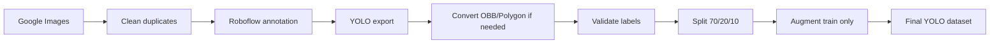

# 🇻🇳 Vietnamese License Plate Dataset YOLO

<div align="center">

<!-- Banner / Logo placeholder -->


<br/>

**Dataset biển số xe Việt Nam chuẩn YOLO Bounding Box cho bài toán License Plate Detection.**

<br/>


</div>

---

## 🚀 Quick Demo & Visuals

<div align="center">

[📦 Kaggle Dataset](https://www.kaggle.com/datasets/tanhphp/vietnamese-license-plates) ·
[🧠 YOLOv26 Training Repo](https://github.com/franceto/Yolov26_License-plate-number_Detection) ·
[👤 Author](https://github.com/franceto)

<br/><br/>


</div>

---

## ✨ Tính Năng Nổi Bật

- 🏷️ **Label chuẩn YOLO bbox:** mỗi biển số được gán nhãn sát vùng biển số, không bao gồm xe hoặc nền thừa.
- 🇻🇳 **Dữ liệu thực tế Việt Nam:** gồm xe máy, xe con, xe tải, nhiều bối cảnh sáng/tối/mờ/chói/che khuất.
- 🧪 **Chia tập an toàn:** train/val/test theo tỉ lệ `70/20/10`, augmentation chỉ áp dụng trên train.
- 🔍 **Kiểm tra no-leak:** giữ nguyên val/test để đánh giá khách quan và hạn chế data leakage.
- 📊 **Có notebook tái tạo:** toàn bộ pipeline xử lý, kiểm tra label, thống kê và tạo biểu đồ nằm trong `notebooks/bs.ipynb`.

---

## 🛠️ Công Nghệ Sử Dụng

<div align="center">


</div>

---

## ⚡ Triển Khai Nhanh

**Prerequisites**

- Python `3.10+`
- Kaggle CLI nếu muốn tải dataset từ Kaggle
- Ultralytics YOLO nếu muốn train/validate/predict nhanh

```bash
# Clone repository
git clone https://github.com/franceto/Dataset_License-plate-number.git
cd Dataset_License-plate-number

# Cài đặt thư viện phụ thuộc
pip install -r requirements.txt
pip install kaggle ultralytics

# Tải dataset từ Kaggle
kaggle datasets download -d tanhphp/vietnamese-license-plates -p ./kaggle_dataset --unzip

# Train nhanh với YOLO
yolo detect train model=yolov8n.pt data=dataset/data.yaml imgsz=640 epochs=100 batch=16

# Validate
yolo detect val model=runs/detect/train/weights/best.pt data=dataset/data.yaml

# Predict ảnh mới
yolo detect predict model=runs/detect/train/weights/best.pt source=path/to/image.jpg
```

---

## 📦 Dataset, Pipeline & Benchmark

### 📌 Tổng Quan Dataset

| Hạng mục | Giá trị |
|---|---:|
| Bài toán | License Plate Detection |
| Quốc gia | Việt Nam |
| Class | `Bien-so` |
| Số class | `1` |
| Tổng ảnh gốc | `728` |
| Tổng bounding box | `964` |
| Label format | YOLO bbox |
| Split ratio | `70 / 20 / 10` |
| Annotation | Roboflow thủ công |
| Augmentation | Chỉ áp dụng trên train |

### 📊 Split Gốc Trước Augmentation

| Split | Images | Labels |
|---|---:|---:|
| Train | 509 | 509 |
| Val | 146 | 146 |
| Test | 73 | 73 |

> Val/test được giữ nguyên để đánh giá công bằng và hạn chế data leakage.

### 🖼️ Visual Statistics

<div align="center">


<br/><br/>

<br/><br/>


</div>

### 🔁 Data Pipeline



### 🧹 Preprocessing & Augmentation

| Nhóm xử lý | Nội dung |
|---|---|
| Preprocessing | Giải nén ảnh, xóa trùng, kiểm tra kích thước, convert label, kiểm tra bbox |
| Split | Chia train/val/test trước augmentation |
| Augmentation train | Brightness/Contrast, Hue/Saturation, Blur nhẹ, Scale/Translate, Rotate nhỏ |
| Không sử dụng | Flip ngang/dọc, xoay 90°/180°, crop mạnh, cutout che trực tiếp biển số |

### 📁 Repository Structure

```text
.
├── assets/
│   ├── bbox_size_distribution.png
│   ├── image_size_distribution.png
│   ├── sample_bbox_grid.png
│   ├── split_distribution.png
│   └── yolov26_detection_result.png
├── notebooks/
│   └── bs.ipynb
├── .gitignore
├── README.md
└── requirements.txt
```

### 🏷️ YOLO Label Format

Mỗi ảnh có một file `.txt` tương ứng:

```text
class_id x_center y_center width height
```

Ví dụ:

```text
0 0.512345 0.634211 0.214532 0.092415
```

Tất cả tọa độ được chuẩn hóa về khoảng `[0, 1]`.

### ⚙️ `data.yaml`

```yaml
train: train/images
val: val/images
test: test/images

nc: 1
names: ['Bien-so']
```

### 🧪 Reproduce Preprocessing

Notebook tái tạo pipeline:

```text
notebooks/bs.ipynb
```

Các bước chính:

```text
1. Giải nén dữ liệu gốc
2. Xóa ảnh trùng
3. Kiểm tra kích thước ảnh
4. Giải nén YOLO export
5. Convert label nếu cần
6. Kiểm tra bbox
7. Split train/val/test
8. Kiểm tra no-leak
9. Augment train
10. Export dataset cuối
11. Tạo biểu đồ README
```

### 🏆 YOLOv26 Benchmark

Repo huấn luyện: [Yolov26 License Plate Number Detection](https://github.com/franceto/Yolov26_License-plate-number_Detection)

| Split | Precision | Recall | mAP50 | mAP50-95 |
|---|---:|---:|---:|---:|
| Validation | 0.9673 | 0.9281 | 0.9672 | 0.6896 |
| Test | 0.9883 | 0.9006 | 0.9494 | 0.6927 |

| Metric | Value |
|---|---:|
| mAP50 | 0.967 |
| mAP50-95 | 0.693 |

### ✅ Final Output

Dataset cuối cùng đã sẵn sàng để huấn luyện YOLO:

- 1 class: `Bien-so`
- Label chuẩn YOLO bbox
- Có sẵn train/val/test
- Train đã được augmentation
- Val/test giữ nguyên
- Có notebook tái tạo pipeline
- Có ảnh minh họa và biểu đồ thống kê

### 🔎 Search Keywords

```text
Vietnamese license plate dataset
Vietnamese license plate YOLO dataset
Vietnam license plate detection
YOLO license plate detection dataset
Biển số xe Việt Nam dataset
Dataset biển số xe Việt Nam YOLO
franceto license plate YOLO dataset
```

### ⚠️ Note

Dataset được xây dựng cho mục đích học tập, nghiên cứu và thực hành Computer Vision.  
Nếu dùng cho sản phẩm thương mại hoặc công bố học thuật, vui lòng kiểm tra thêm về bản quyền ảnh, quyền riêng tư và nguồn dữ liệu gốc.

### 👥 Authors

**franceto (ANH PHAP TO)**  
GitHub: [https://github.com/franceto](https://github.com/franceto)

### ⭐ Support

Nếu project hữu ích, hãy cho repo một sao nhé! ⭐

Made with ❤️ by **Franceto (ANH PHAP TO)**
